# Hi 👋, I'm Joshua

### A passionate C developer

  

- 👯 I'm looking to collaborate on **Low level, Parsers, Compilers, VMs, CLI tools**

- 📫 How to reach me **labprogramming7@gmail.com**

<h3 align="left">Connect with me:</h3>

<h3 align="left">Languages and Tools:</h3>

                    

&nbsp;

